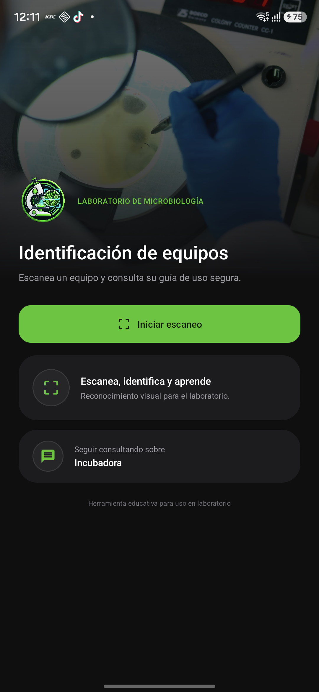
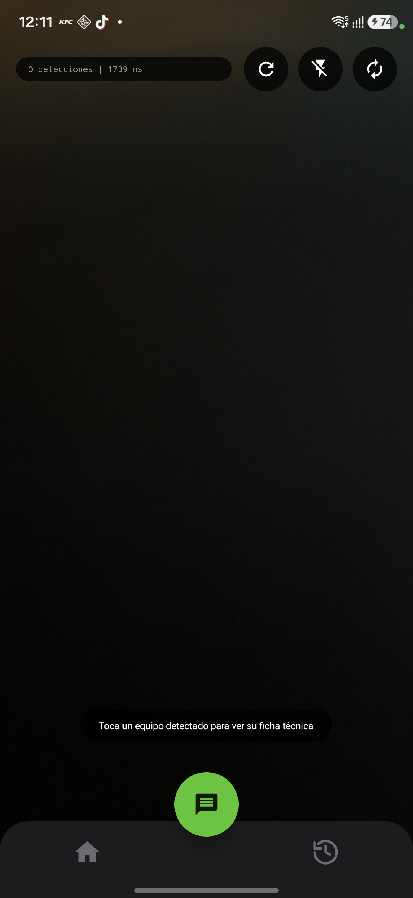
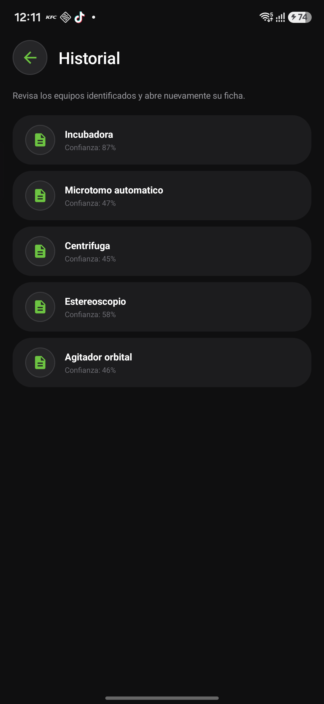
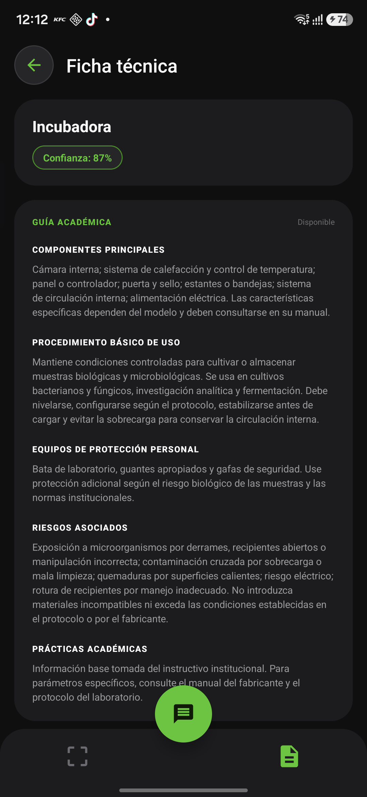
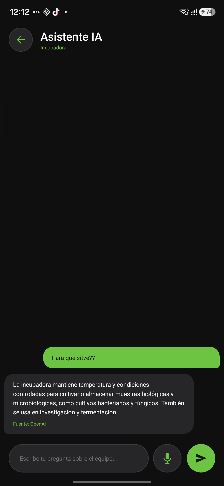
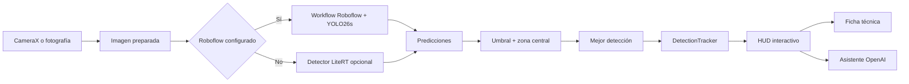

<div align="center">
  

  # Microbiological Detection

  **Identificación inteligente de equipos para el Laboratorio de Microbiología UTEQ**

  Cámara en tiempo real, detección con YOLO26s, fichas académicas y un asistente especializado con IA.

  
  
  
  
  
</div>

## Descripción

Microbiological Detection es una aplicación Android educativa que reconoce el equipo de laboratorio al que apunta la cámara. Después de identificarlo, permite consultar su ficha técnica, revisar indicaciones de uso y conversar con un asistente de IA que mantiene el contexto del equipo seleccionado.

El proyecto fue desarrollado para apoyar el aprendizaje dentro del Laboratorio de Microbiología de la Universidad Técnica Estatal de Quevedo. El conjunto de imágenes utilizado para entrenar el detector fue obtenido directamente de los equipos presentes en el laboratorio y organizado y etiquetado en Roboflow.

## Diseño final

<div align="center">
  
  
  
  
  
</div>

## Funcionalidades

- Escaneo de video en tiempo real mediante CameraX.
- Análisis de fotografías seleccionadas desde el Photo Picker de Android.
- Captura de fotografías a resolución completa mediante `TakePicture` y `FileProvider`.
- Inferencia remota con un Workflow de Roboflow y un modelo YOLO26s personalizado.
- Selección del objeto más confiable que intersecta la zona central de enfoque.
- HUD animado inspirado en un escáner tecnológico, con caja, clase y confianza.
- Continuidad visual entre inferencias mediante suavizado y retención corta de fotogramas vacíos.
- Congelado de la imagen al enfocar un resultado para facilitar la lectura y la interacción.
- Control de linterna, cambio de cámara y reinicio manual del escáner.
- Ficha académica con componentes, procedimiento, EPP, riesgos y prácticas.
- Información institucional integrada y enriquecimiento mediante IA cuando faltan campos.
- Asistente especializado que limita las preguntas al equipo seleccionado.
- Entrada por voz con `SpeechRecognizer` y lectura de respuestas con `TextToSpeech`.
- Conversaciones persistentes por equipo, con recuperación de los últimos 40 mensajes.
- Historial local de equipos escaneados y caché de fichas para accesos posteriores.
- Interfaz oscura, animaciones de interacción y soporte completo para edge-to-edge en Android 15.

## Flujo de reconocimiento



### Modelo YOLO26s y dataset

El modelo de visión fue entrenado en Roboflow usando fotografías tomadas en el laboratorio. Las imágenes se anotaron con cajas delimitadoras para que el modelo aprendiera la apariencia real de cada equipo, incluyendo variaciones de ángulo, distancia, iluminación y fondo.

Clases contempladas por la aplicación:

`Agitador`, `Agitador orbital`, `Autoclave`, `Balanza analítica`, `Balanza eléctrica`, `Baño María`, `Cabina de flujo laminar`, `Calentador de agua`, `Centrífuga`, `Contador de colonias`, `Deshidratadora`, `Estereoscopio`, `Incubadora`, `Microscopio`, `Microtomo automático`, `Placa de calentamiento` y `Refrigerador`.

La integración actual envía el fotograma como imagen Base64 al endpoint del Workflow de Roboflow. La aplicación acepta predicciones desde 45 % de confianza, exige intersección con la zona central y muestra únicamente la detección más confiable para evitar sobrecargar la interfaz con objetos fuera del foco.

## Asistente con OpenAI

El asistente consume la Responses API de OpenAI mediante OkHttp. Cada solicitud incluye:

- El nombre normalizado del equipo escaneado.
- Conocimiento institucional disponible para ese equipo.
- El historial previo de la conversación.
- Instrucciones para responder exclusivamente preguntas relacionadas con el equipo.

La ficha técnica y el chat son funciones separadas: la ficha organiza información académica estructurada, mientras el chat responde preguntas concretas como el propósito de un botón, un procedimiento o una precaución. Las respuestas se muestran sin marcas de Markdown molestas y pueden escucharse por voz.

## Tecnologías

- Kotlin y Android Views.
- ViewBinding.
- Android Gradle Plugin 9.2.1.
- compileSdk y targetSdk 35, minSdk 26.
- CameraX 1.4.2.
- Material Components 1.12.0.
- Kotlin Coroutines 1.8.1.
- OkHttp 4.12.0.
- Roboflow Workflows y YOLO26s.
- OpenAI Responses API.
- LiteRT 1.2.0 para el detector local opcional.
- SharedPreferences y JSON para historial, conversaciones y caché local.
- SpeechRecognizer y TextToSpeech de Android.
- Photo Picker, TakePicture y FileProvider para imágenes estáticas.

## Arquitectura del proyecto

```text
app/src/main/
├── java/com/example/microbiologicaldetection/
│   ├── data/       Modelos, conocimiento institucional, sesiones e historiales
│   ├── ml/         Detecciones, seguimiento y soporte LiteRT
│   ├── network/    Clientes de Roboflow y OpenAI
│   └── ui/         Activities, adaptadores, overlay e insets
├── res/            Layouts, tema oscuro, iconos y recursos gráficos
└── assets/         Instrucciones para incorporar un modelo TFLite opcional
```

## Configuración local

Las credenciales no se guardan en Git. Crea o completa `local.properties` en la raíz:

```properties
sdk.dir=C\:\\ruta\\al\\Android\\Sdk

ROBOFLOW_API_KEY=tu_clave_de_roboflow
ROBOFLOW_MODEL_URL=identificador_o_url_del_modelo
ROBOFLOW_ENDPOINT=https://serverless.roboflow.com/tu-workspace/workflows/tu-workflow

OPENAI_API_KEY=tu_clave_de_openai
OPENAI_BASE_URL=https://api.openai.com
OPENAI_ENDPOINT=/v1/responses
OPENAI_MODEL=gpt-5.6-luna
```

Nunca publiques este archivo ni compartas las claves en capturas, issues o commits.

> [!IMPORTANT]
> `BuildConfig` evita guardar secretos directamente en el código fuente, pero una clave incluida en una APK todavía puede extraerse. Para distribuir la aplicación públicamente se recomienda colocar las llamadas a Roboflow y OpenAI detrás de un backend propio con autenticación, límites de uso y rotación de credenciales.

## Compilación

Clona el repositorio, configura `local.properties` y ejecuta:

```bash
./gradlew assembleDebug -Pandroid.overridePathCheck=true
```

En Windows:

```powershell
.\gradlew.bat assembleDebug "-Pandroid.overridePathCheck=true"
```

La propiedad `android.overridePathCheck` es necesaria en este entorno porque la ruta de trabajo contiene el carácter acentuado de `Aplicaciones Móviles`.

## Detector local opcional

La aplicación contiene la integración con LiteRT como respaldo cuando Roboflow no está configurado o la petición falla. Para activarla se deben proporcionar `model.tflite` y `labels.txt` dentro de `app/src/main/assets/`, respetando el formato indicado en `instrucciones.txt`.

Estos archivos no están incluidos actualmente, por lo que la configuración funcional principal del repositorio utiliza Roboflow.

## Consideraciones de seguridad

- La confianza de una detección no demuestra por sí sola que el equipo sea correcto.
- El EPP y los riesgos deben contrastarse con el protocolo institucional y el manual del fabricante.
- La aplicación es una herramienta educativa y no reemplaza la supervisión del docente o responsable del laboratorio.
- La inferencia remota y el asistente requieren conexión a Internet.
- No deben enviarse a servicios externos imágenes con información sensible o personas identificables.

## Estado

El proyecto compila correctamente y fue validado en un Samsung SM-A566E con Android. Las capturas de este README se obtuvieron directamente de esa ejecución.

---

<div align="center">
  Desarrollado como herramienta educativa para el Laboratorio de Microbiología UTEQ.
</div>
